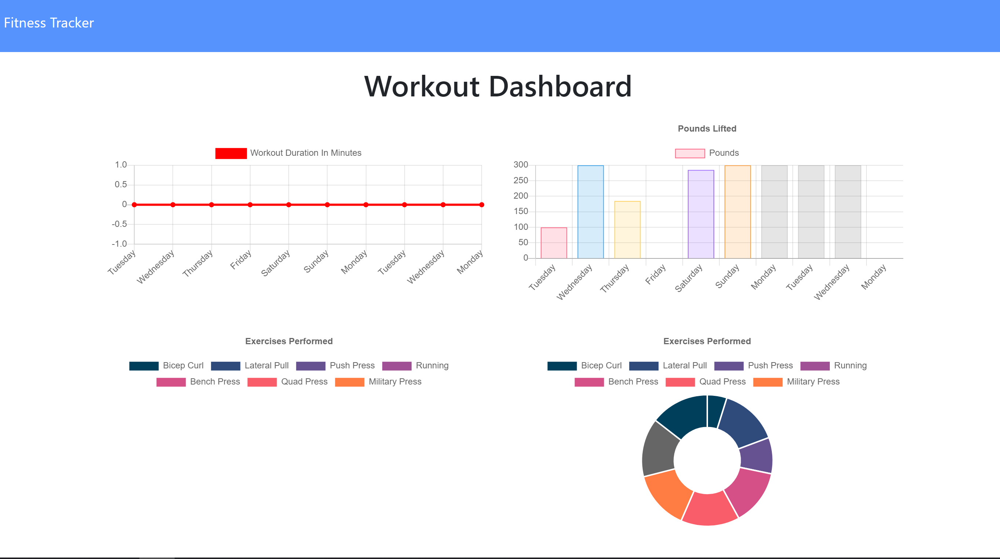
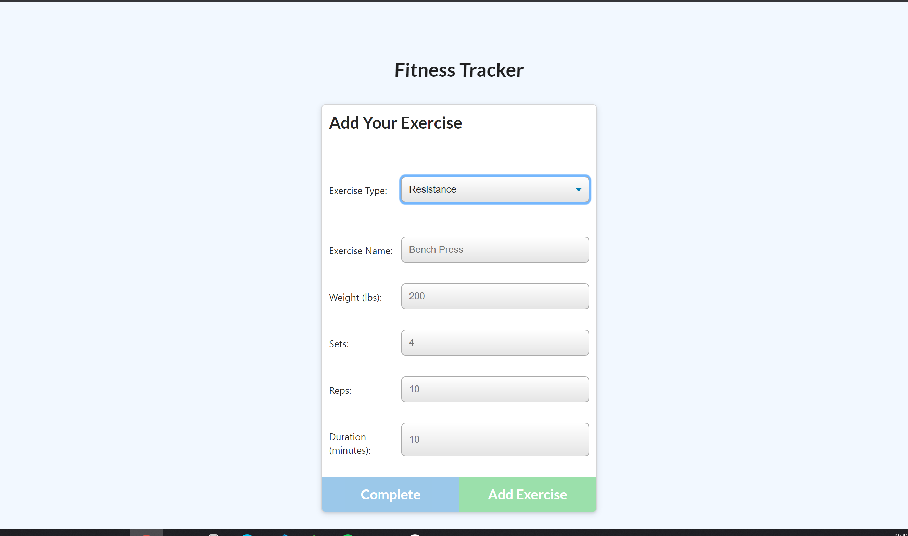
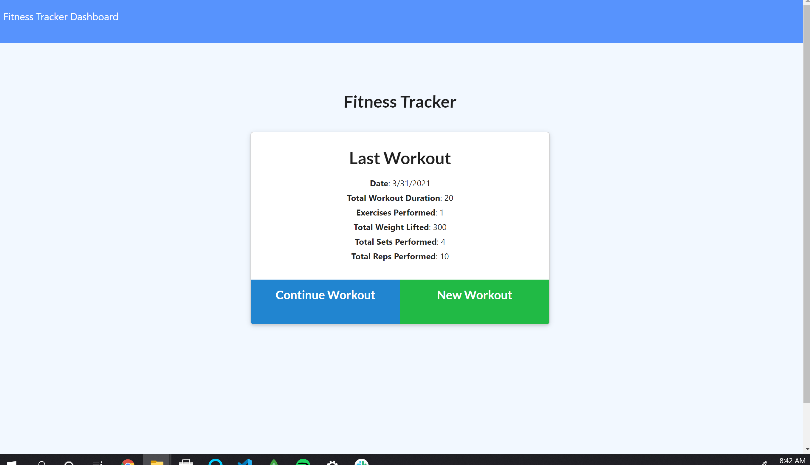

# refractored_fitness_tracker

## Table of Contents 

[Description](#description)

[Screenshots](#screenshots)

[Link to deployed app](#link)

[Questions](#questions)

## Description 

With this application, the user has an interactive way to keep track of their daily workouts. The user can input as many exercises into the workout they've completed for that day. The application also includes a graph section to give the user a better visualization on the progress of their workouts.

## Screenshots

## Link 
[Link to deployed Heroku app](https://enigmatic-earth-81798.herokuapp.com/)

## Questions 

If you have any questions about the repo, open an issue or contact me directly at mlavina91@gmail.com. 
You can find more of my work at (https://github.comLavina91/)